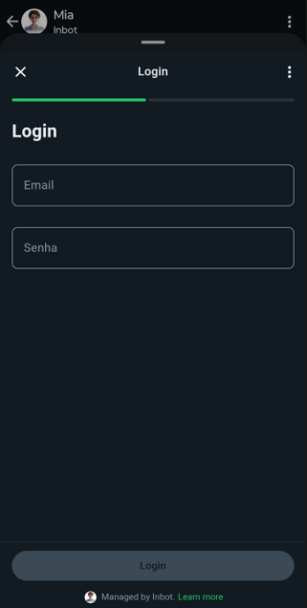
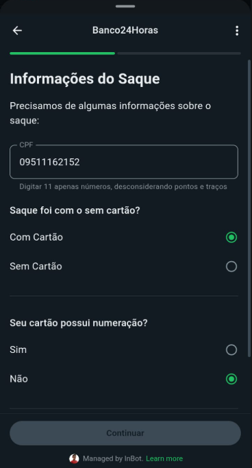

# 🧪 Exemplos

Você pode testar os exemplos abaixo diretamente no WhatsApp para entender como os _Flows_ funcionam na prática.

---

## 🔐 2FA – Autenticação em Dois Fatores

Exemplo de autenticação com dois passos: **email** e **senha**, seguido por um campo de **código de verificação**.

- Email: qualquer email válido
- Senha: `12345678`
- Código: qualquer número com **6 dígitos**

👉 [Clique aqui para testar o Flow 2FA](https://wa.me/5511953188171?text=FLOW_AUTH)

---

## 🤖 Bots – Rádio com Imagens

Exemplo com componente `Radio` exibindo opções com **imagens e descrições**.

👉 [Clique aqui para testar o Flow Bots](https://wa.me/5511953188171?text=FLOW_BOTS)

---

## 🏦 Tecban (INCOMPLETO)

Exemplo de um flow grande, com dropdowns, radios, campos digitação, multiplo finals, etc.

👉 [Clique aqui para testar o Flow, Digita Nome Completo -> Consumidor -> Falar sobre um saque](https://wa.me/5511964410329?text=INICIO)

---
