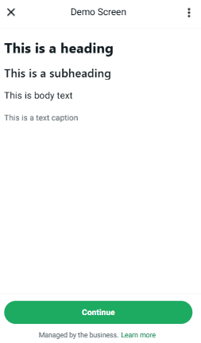
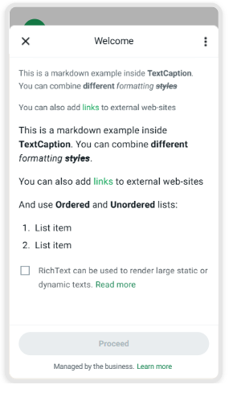
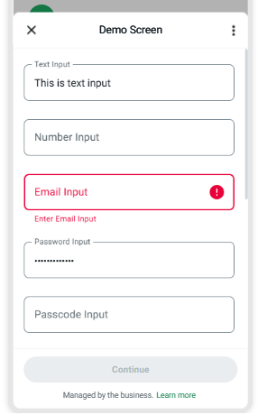
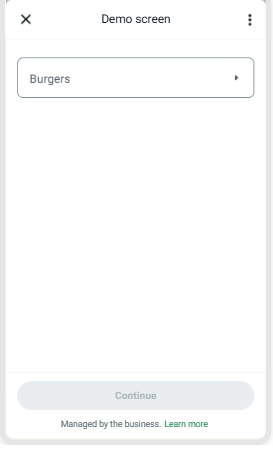
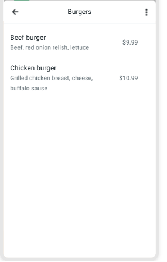
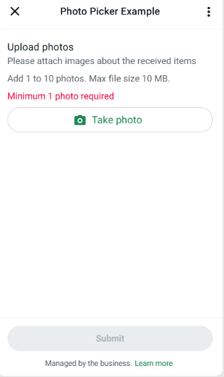
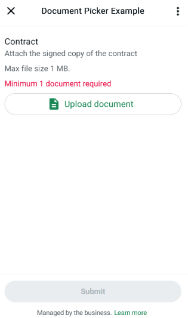

# 📦 Componentes

A seguir, explicamos em detalhes como funciona cada **componente** de um _flow_, o que ele precisa e como utilizá-lo corretamente.

Para mais informações, consulte a [documentação oficial do WhatsApp](https://developers.facebook.com/docs/whatsapp/flows/reference/components).

---

## 🏞️ Imagem


Podemos colocar uma imagem dentro do flow, alutra e largura pode ser configurado. O exemplo é `200x200`.

---

## ✏️ Textos

### 🧩 Básicos



Existem 4 tipos principais de textos:

- `TextHeading`
- `TextSubheading`
- `TextBody`
- `TextCaption`

Na maioria dos casos, usamos apenas o **header** (`TextHeading`) e o **body** (`TextBody`). Ambos recebem `string` como conteúdo.

---

### 💡 RichText (Texto com Markdown)



Quando for necessário aplicar formatações, utilize o componente `RichText`, ou qualquer um dos anteriores com o parâmetro `markdown: true`. Exemplo:

```json
{
  "type": "TextCaption",
  "markdown": true,
  "text": [
    "Este é um exemplo com **Markdown** no **TextCaption**. Você pode combinar *diferentes* ~~***estilos***~~",
    "Também é possível adicionar [links](https://whatsapp.com) para sites externos."
  ]
}
```

É similar ao estilo de formatação usado em ferramentas como Loop e Notion — prático e visual!

---

## 🧾 Campo de Texto (Text Input)



O campo de texto possui o parâmetro `input-type`, que pode ter os seguintes valores:

```json
["text", "number", "email", "password", "passcode", "phone"]
```

Se precisar de uma validação específica (por exemplo, CPF ou CNPJ), é possível usar **regex**, uma técnica comum na programação para definir padrões de entrada. Consulte [regex101.com](https://regex101.com) para testar suas expressões.

---

## 🔘 Radio / Select


Esses componentes permitem oferecer múltiplas opções ao usuário:

- `Radio`: permite selecionar apenas **uma** opção.
- `Select`: permite selecionar **várias** opções.

Formato padrão:

```json
[
  {
    "id": "1",
    "title": "Opção 1",
    "image": "link-da-imagem",
    "description": "Descrição da opção 1"
  }
]
```

Apenas os campos `id` e `title` são **obrigatórios**. É possível ter até **20 itens**. Para mais opções, utilize o componente [`Dropdown`](#dropdown).

---

## ⬇️ Dropdown




O componente `Dropdown` suporta até **200 opções** e utiliza o **mesmo formato JSON** do Radio/Select:

```json
[
  {
    "id": "1",
    "title": "Opção 1",
    "image": "link-da-imagem",
    "description": "Descrição da opção 1"
  }
]
```

Ideal para listas longas com várias opções.
igual como Radio/Checkbox os campos `id` e `title` são obrigatórios.

---

## 📤 Subir

É possível configurar o componente para permitir o envio de **1 a 30 imagens/arquivos**, com tamanho total de até **100 MiB**.
O tamanho **individual máximo** de cada imagem pode ser de **25 MiB**.

> ⚠️ Só é permitido **um componente de envio de mídia por tela**. Ou seja, não é possível ter dois componentes do tipo "Subir Foto" ou "Subir Arquivo" na mesma tela.

Para mais detalhes, consulte a [documentação oficial do Meta](https://developers.facebook.com/docs/whatsapp/flows/reference/media_upload).

### 📸 Fotos



Você também pode definir a **origem da imagem** — se será capturada pela câmera, selecionada da galeria, ou ambas:

```json
["camera_gallery", "camera", "gallery"]
```

### 📁 Arquivos

Se o componente for configurado para aceitar **arquivos**, ele permitirá o envio de diversos formatos. Também é possível restringir os tipos aceitos para apenas alguns específicos.



Formatos suportados:

1. application/gzip
2. application/msword
3. application/pdf
4. application/vnd.ms-excel
5. application/vnd.ms-powerpoint
6. application/vnd.oasis.opendocument.presentation
7. application/vnd.oasis.opendocument.spreadsheet
8. application/vnd.oasis.opendocument.text
9. application/vnd.openxmlformats-officedocument.presentationml.presentation
10. application/vnd.openxmlformats-officedocument.spreadsheetml.sheet
11. application/vnd.openxmlformats-officedocument.wordprocessingml.document
12. application/x-7z-compressed
13. application/zip
14. image/avif
15. image/gif
16. image/heic
17. image/heif
18. image/jpeg
19. image/png
20. image/tiff
21. image/webp
22. text/plain
23. video/mp4
24. video/mpeg

---

## 📝 Observações

- Os componentes podem ser **combinados dinamicamente** com base na interação do usuário.
- Também podem ser marcados como:

  - `obrigatórios`: o usuário precisa preencher antes de continuar;
  - `visíveis`: condição para exibição com base em regras.

### 🧪 Exemplo prático

Imagine uma tela com um dropdown:

1. O usuário seleciona a **Opção 1** → um **checkbox** aparece.
2. O usuário seleciona a **Opção 2** → um **radio** aparece.

Essas dinâmicas ajudam a tornar a interface mais inteligente e personalizada.

---

> 🔗 Um exemplo real pode ser encontrado no fluxo da **Mia**. (Inserir link aqui)
