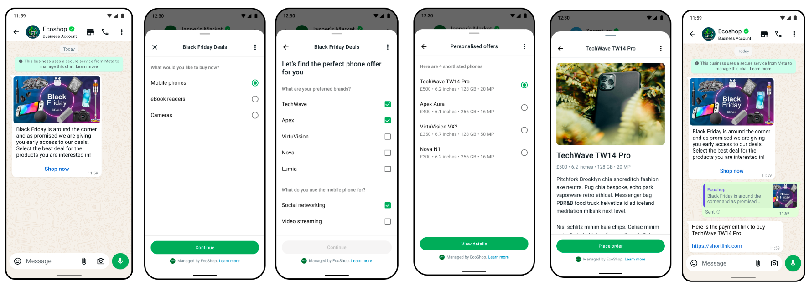
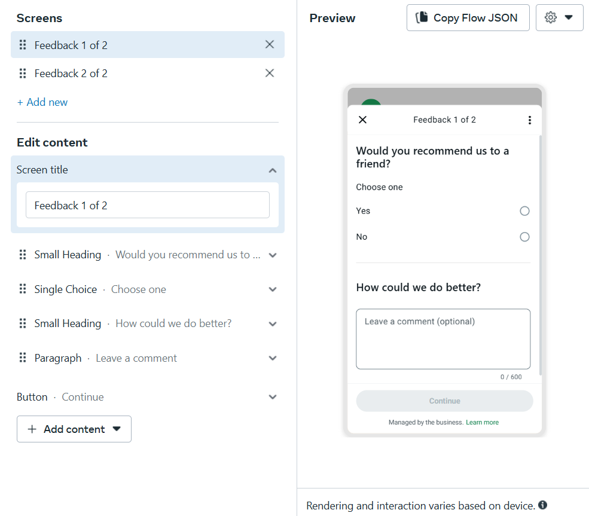

# 💬 O que é _Flows_?

**Flows** são telas de formulário interativas no WhatsApp. Elas podem ser usadas para:

- Agendamentos
- Compras
- Cadastros
- E outros tipos de coleta de dados do usuário

São extremamente poderosos, mas precisam seguir as regras definidas pelo **Facebook**.

---

## ⚠️ Regras importantes

- **Cada flow deve terminar com apenas UM botão** — não é possível adicionar dois botões finais.
- Se você tem múltiplas telas, por exemplo:  
  `Tela 1` → `Tela 2`, a `Tela 2` **não pode retornar** para a `Tela 1`.  
  Isso evita **loops** e garante uma navegação linear.

---

## 🔧 Como funciona na prática?

O flow é construído em **JSON**, mas sua lógica é modular — como se fosse um **Lego**:  
Você escolhe os componentes que precisa para montar seu flow.

Para entender melhor, use o criador visual do Facebook:  
👉 [WhatsApp Flow Playground](https://developers.facebook.com/docs/whatsapp/flows/playground)

---

## 🛠️ Como usamos o Flow

Nosso processo segue esta estrutura:

1. **Criamos o esqueleto do Flow** na [Business Manager (business.meta)](https://business.facebook.com).

2. A **ficha do bot** complementa as informações dinâmicas:

   Isso evita a necessidade de re-publicar o Flow para pequenas mudanças, como textos ou dados variáveis.

   Claro, se for necessário **adicionar um novo campo**, aí sim será preciso alterar o Flow e publicá-lo novamente.

3. O usuário interage com a interface:

   A tela de Flow coleta as informações da ficha.

   Depois, os dados são passados para o próximo Flow, e assim por diante.
