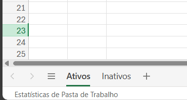

## O que é?

Se você não possui um banco de dados ou API própria, a Inbot pode criar um para você com base em uma planilha que você enviar.

## Como Funciona?

### 1. Primeiro Passo – Envio dos Dados

Envie todas as informações do seu banco de dados (por exemplo, uma lista de carros) em formato de planilha.

### 2. Criação do Banco

A equipe da Inbot irá criar um banco otimizado com base nos dados enviados.  
Assim que estiver pronto, você receberá uma planilha no formato exato do BD.

### 3. Atualização de Dados

Para atualizar o BD, basta editar a planilha enviada anteriormente, mantendo o formato original, e nos avisar.
Se precisar **deletar/desativar** uma linha, copie a linha para outra aba chamada **"desativado"**, isso agiliza o processo de atualização.

## Regras Adicionais para Imagens no Flow

Se você deseja utilizar imagens no flow, siga as regras abaixo:

- **Validações:**  
  Dependendo do que foi combinado, alguns campos só vão aceitar números ou não podem ficar em branco.  
  Exemplo: um campo de valor deve ser `1000` — não é válido colocar `mil` ou `R$ 1000`.  
  No bot, a informação vai aparecer formatada, mas no BD ela precisa seguir o padrão correto.
- **Proporção:** 1:1 (imagens quadradas)
- **Tamanho:**
  - Para aparecer no _dropdown_: **menos de 10 KB**
  - Para imagens grandes: **menos de 300 KB**
- **Formatos:** PNG ou JPEG/JPG
- **Dica:** Use a ferramenta [Squoosh](https://squoosh.app/) para reduzir o tamanho das imagens.
